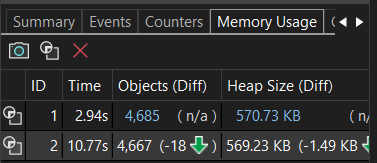
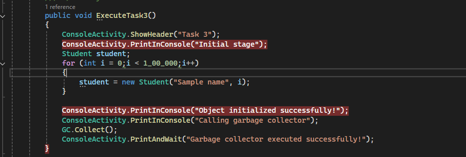
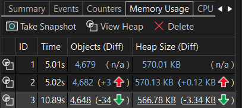

# Task 1 -> Value and Reference Types

## ?? Key Learnings & Concepts

### 1. Value Types (Stored on the Stack)
* **The Copy Behavior:** When you pass a value type (e.g., an integer or a struct) into a method, C# does not give the method access to the original variable. Instead, it makes a **complete, independent copy** of the value.
* **Isolation:** Because the method works purely on a copy, any modifications made inside that method stay inside that method. The original variable in your main code remains completely safe, isolated, and unchanged.

### 2. Reference Types (Stored on the Heap)
* **The Pointer Behavior:** When you pass a reference type (e.g., an instance of a class) into a method, C# does not copy the actual object data. Instead, it copies the **memory address (pointer)** pointing to where that object lives in memory.
* **Shared Access:** Because the method receives a copy of the pointer, both your main code and the method are looking at the **exact same object** in memory. If the method alters a property on that object, the changes are immediate and permanent for everyone.

### 3. Stack vs. Heap Memory
* **The Stack:** Used for short-lived data, like local variables and value types. It is fast, self-managing, and works like a neat stack of plates.
* **The Heap:** Used for larger, dynamic objects like classes. It holds the actual data for reference types, which stays alive as long as someone has a pointer pointing to it.

# Task 2 -> Stack vs. Heap Allocation Profiling

### 1. Large Array Allocations (Heap Heavy)
* **The Reference Type Impact:** Arrays in C# are reference types, regardless of the data type they hold (even an array of integers). When an array is instantiated, the actual data block is allocated on the **Heap**.
* **Memory Footprint:** Allocating a massive array causes a measurable and sustained spike in your application's Managed Heap usage. This memory stays occupied until the array goes out of scope and the Garbage Collector (GC) runs to reclaim it.

### 2. High Density Local Variables (Stack Heavy)
* **The Value Type Impact:** Local variables (like individual integers, doubles, or structs) declared directly inside a method are allocated entirely on the **Stack**.
* **Memory Footprint:** Even if you declare hundreds of local variables to perform a complex calculation, they take up virtually zero Heap memory. Instead, they expand the current execution thread's **Stack Frame**. 
* **Instant Cleanup:** Unlike Heap memory, Stack memory requires zero garbage collection. The exact millisecond the method finishes executing, its Stack Frame is popped off, and all that memory is instantly reclaimed by the CPU.

### 3. Profiler Visualization (Sawtooth vs. Flatline)
* **Heap Profiling:** In a tool like Visual Studio Diagnostic Tools, the large array method will generate a distinct visual **"sawtooth" step up** on the Process Memory graph.
* **Stack Profiling:** The local variables method will show a completely **flat line** on the Managed Heap graph, because Stack allocations do not register as Heap inflation.

# Task 3 -> Learning: Garbage Collection and Performance Impact
### 1. The Allocation Spike (Managed Heap)
* **Object Creation:** When you rapidly instantiate millions of objects inside a loop, they are allocated on the **Managed Heap**. Even if these objects go out of scope immediately, they continue to sit in memory as "dead objects" until a collection occurs.
* **Memory Growth:** This creates a steep climbing curve in memory metrics, as the application hoards these unreferenced objects waiting for the runtime engine to clean them up.

### 2. What Happens During `GC.Collect()`
* **Manual Overriding:** By default, C# manages memory automatically. Calling `GC.Collect()` forces the engine to stop what it is doing and manually scan the entire heap across all generations (Gen 0, 1, and 2) to free up unreferenced memory.
* **The "Stop-the-World" Phase:** When garbage collection triggers, it often pauses your application's execution threads. This ensures that object references don't shift around while the GC is remapping and compacting memory.

### 3. The Performance Trade-off
* **Memory vs. CPU:** While triggering `GC.Collect()` successfully drops your application's memory footprint back to its baseline, it introduces a severe **CPU performance hit**. 
* **The Latency Cost:** Frequent manual collections introduce stuttering, micro-freezes, and increased latency. In real-world applications, letting the .NET runtime handle garbage collection automatically is vastly more efficient than forcing it manually.

