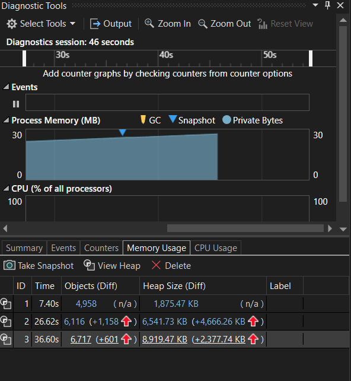
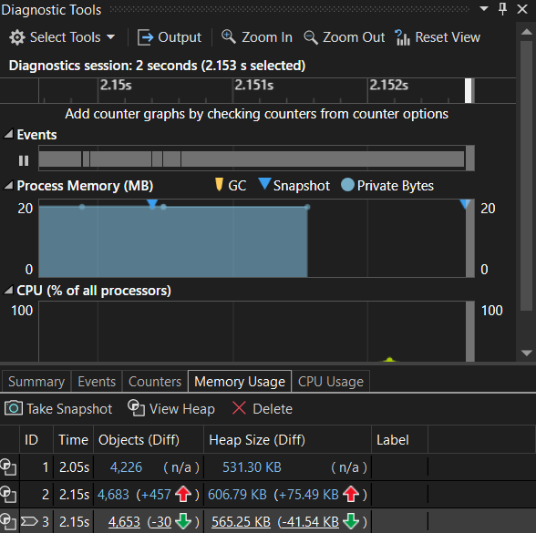
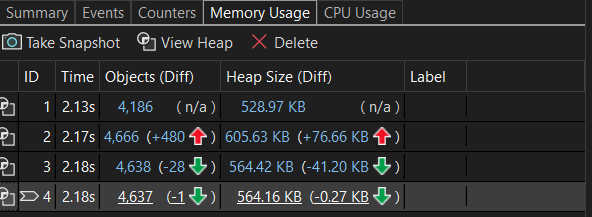

# Assignment 12 - Memory Optimization

## Task 1: Memory Leak / Optimization Identification

This section focuses on identifying and analyzing a subtle memory retention behavior in C# when managing dynamic collections, specifically looking at how `List<T>` elements are cleared versus how its internal buffers behave on the managed heap.

### Problem Analysis
The unoptimized implementation of the `MemoryEater` class contains a severe memory leak that inevitably forces an `OutOfMemoryException`. The issue stems from structural logic flaws rather than native `.NET` collection behavior:

1. **Unbounded Allocation Loop:** The `while (true)` block creates an infinite loop. It continuously constructs new `int[1000]` arrays on the managed heap every 10 milliseconds without a termination condition.
2. **Permanent Reference Retention:** Every newly allocated array is instantly appended to the class-scoped private field `_memAlloc`. Because the `MemoryEater` instance holds a live reference to this list, the Garbage Collector (GC) can never mark these arrays for collection. 
3. **Monolithic Heap Bloat:** Memory usage climbs linearly over time. The application will consume all available virtual memory until it crashes, as no mechanism exists to clear the collection or break the loop.

### Diagnostic Analysis (Task 1)

The profiling workflow below validates this behavior using memory snapshots captured during execution:



- **Snapshots 1–3 ** : It shows a gradual memory growth, proving that references are being retained. This will ultimately result in an application crash.

---

## Task 2: Code Optimization & Resolution

To completely eliminate the memory leak and release the infrastructure overhead back to the system, the infinite loop was replaced with a bounded execution scope, and the resource lifecycle is now explicitly managed using the `IDisposable` pattern.

### Solution Implementation
By transitioning to a deterministic loop (`count < 10`), we prevent unbounded heap growth. Furthermore, implementing the `IDisposable` interface allows us to break the root reference entirely by nullifying the collection field, signaling to the Garbage Collector that the entire memory block is ready for reclamation.

```csharp
// The resource lifecycle is managed via the Dispose pattern
public void Dispose()
{
    // Breaks the root reference entirely, making the list eligible for GC
    this._memAlloc = null;
    this._isDisposed = true;
}
```

### Diagnostic Verification

The execution steps below map how the heap memory behaves through each stage of the optimized lifecycle:



* **Snapshot ID-1 (Baseline State):** Initial memory footprint prior to triggering any allocation. The `_memAlloc` list is initialized but empty.
* **Snapshot ID-2 (Peak Memory State):** Taken during the 10-iteration loop. It represents the peak memory overhead where all 10 integer arrays coexist concurrently on the heap.
* **Snapshot ID-3 (Post-Execution State):** Taken after the `Allocate()` method completes but before disposal. The memory remains stable and flat (no longer climbing infinitely) because the loop has a strict termination boundary.
* **Snapshot ID-4 (Post-Disposal State):** Final memory state following the invocation of `.Dispose()`. Because `_memAlloc` is set to `null`, the strong references to the arrays are severed. The snapshot verifies that the Garbage Collector has swept the unreferenced memory, returning the application's active footprint fully back to its baseline value. **Snapshot ID-4:** Final memory state following `this._memAlloc.TrimExcess()`. The snapshot verifies that structural capacity allocations are successfully discarded, and the object's active footprint returns fully to its baseline values.

## Task 3: Memory Profiling & Analysis

### Objective
To use the Visual Studio Memory Profiler to analyze and verify how our optimizations transformed the memory lifecycle of the application on the managed heap.

### Memory Usage Comparison: Quick Overview

Here is a side-by-side comparison of how memory behaves in both versions:

| Execution Stage | Unoptimized Code (Task 1) | Optimized Code (Task 2) |
| :--- | :--- | :--- |
| **1. Baseline Start** | Low memory footprint | Low memory footprint |
| **2. During Execution** | **Infinite Growth:** Memory climbs nonstop until it crashes | **Bounded Growth:** Controlled allocation peaks safely |
| **3. Post-Execution** | Never reached (Crashes with `OutOfMemoryException`) | Stable memory holding the 10 allocated arrays |
| **4. Post-Disposal** | N/A | **Zero Overhead:** References severed; GC reclaims all memory |

---

### Why Did This Change Happen? 

To understand why this optimization worked, we can look at how object references behave on the managed heap:

1. **The Unoptimized Leak Lifecycle:** 
   The original code lacked a termination condition and a way to break reference chains. Because the list was class-scoped, every single allocated array was permanently anchored to the application root. The Garbage Collector (GC) was completely blocked from reclaiming the memory, leading to immediate heap exhaustion.
2. **The Bounded & Disposable Fix:** 
   By limiting the allocation loop to a strict count of 10, we halted the runaway memory growth. Introducing the `IDisposable` pattern allowed us to explicitly set the list reference to `null`. This severs the root reference chain, flagging the entire collection and its underlying arrays as dead objects so the GC can instantly wipe them from the heap.

### What We Learned From the Visual Studio Profiler
* **Unbounded loops trigger fatal crashes:** Without deterministic exit conditions, managed languages like C# will quickly exhaust memory, regardless of how efficient the underlying data structure is.
* **Scope and lifecycle management matter:** Keeping collections open indefinitely creates a permanent memory anchor. Implementing patterns like `IDisposable` gives us precise, predictable control over when memory is released.
* **Profilers show the invisible:** The Visual Studio profiling tool allows us to observe real-time heap generation data, making it easy to spot structural leaks and confirm that our cleanup code is executing correctly.

### Diagnostic Verification (Task 3)



* **Snapshot 1 (Start):** The program starts at a clean **529 KB**.
* **Snapshot 2 (Peak):** After making 10 arrays, memory jumps up to **605 KB**.
* **Snapshot 3 (Cleaned):** After calling `Dispose()`, memory drops down to **564 KB**.

### Brief explanation on each snapshot :

1. **Why did memory go up by 76 KB? (529 KB → 605 KB)**
   * **The Data (~40 KB):** We made 10 groups of 1,000 numbers. This data takes up about 40 KB.
   * **The Text (~36 KB):** Printing messages to the screen (`Console.WriteLine`) takes up temporary memory space.

2. **Why did memory drop by 41 KB? (605 KB → 564 KB)**
   * When we called `Dispose()`, we remove the reference to the list.
   * The computer instantly erased the 40 KB of number data because you didn't need it anymore.

3. **Why didn't it go all the way back to 529 KB?**
   * The leftover 35 KB is **not a leak**. It is just the text history from the console logs that the computer automatically cleans up a bit later on its own.

## Task 4 - Reflection & Key Learnings

This assignment helped me understand how C# manages memory and how the **Garbage Collector (GC)** works. I learned that objects stay in memory as long as something is pointing to them. Even though C# handles memory automatically, developers still need to be careful not to hold onto unnecessary data.

### Challenges & Observations
The most challenging but interesting part was analyzing the **memory snapshots**. It was eye-opening to watch the heap memory spike up as arrays were added to the list. Comparing the snapshots before and after the fix helped me clearly see when objects were active and when they were finally ready to be cleaned up.

### Key Takeaways
* **Reference Lifecycles:** In the `MemoryEater` example, I saw how clearing a list breaks the connection to the arrays so the GC can reclaim that space. 
* **Clear() vs Null:** I learned that `Clear()` keeps the list structure ready to reuse, while setting it to `null` destroys the list container entirely.
* **Tooling Value:** This task showed me how valuable Visual Studio's **Diagnostic Tools** are for finding hidden memory waste and proving that an optimization actually worked.

